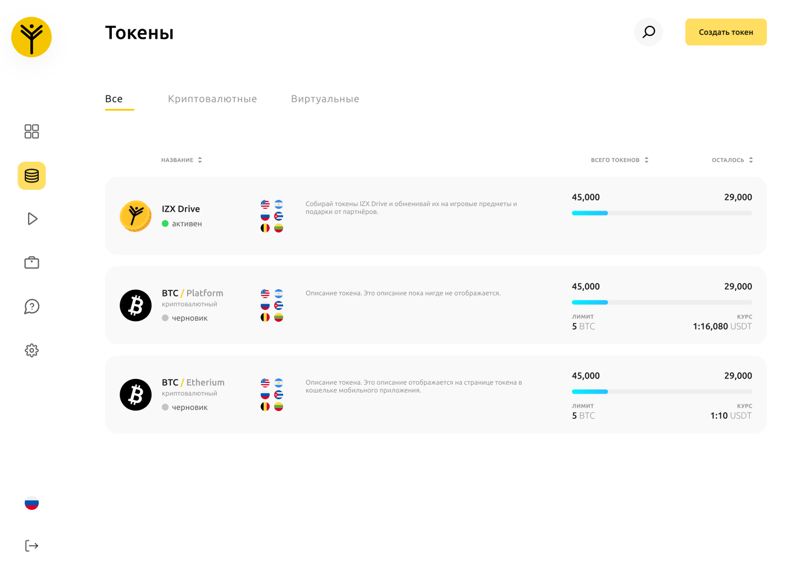

# Токены
Токены - виртуальная валюта, которую может эмитировать рекламодатель, для дальнейшей раздачи игрокам платформы в рамках рекламных кампаний и последующего обмена их на вознаграждения, предлагаемые рекламодателем. Токен может быть двух типов:

-	__Криптовалютный__

    Этот тип токена используется в случаях, когда продукт рекламодателя криптовалютный. Подразумевается возможность обмена на криптовалютный токен рекламодателя
-	__Виртуальный__

    Этот тип токена существует только в рамках платформы, используется во всех остальных случаях. Подразумевается возможность обмена на продукт рекламодателя.

## Создание токена.
Чтобы создать токен перейдите на страницу создания токена, либо после входа в аккаунт выберите из бокового меню вкладку “Токены”, затем вверху-справа нажмите кнопку “Создать токен”. Сначала вам необходимо выбрать один из типов токена описанных ранее.

### Создание виртуального токена.
-	Выберите локализации токена. Для этого вы можете выбрать язык путём нажатия на выпадающий список “Выберите язык”.
-	Ввести название токена с максимальной длиной в 20 символов.
-	Ввести тикер с максимальной длиной в 5 символов и в верхнем регистре, например BTC, ETH, TRN.
-	Ввести количество токенов, являющимся максимальным для одного игрока.
-	Загрузить логотип токена с минимальным разрешением в 512х512 пикселей.
-	Ввести описание для этого токена с максимальной длиной в 400 символов. Чтобы сменить языковую группу, для которой вы пишите описание нажмите на иконку флага снизу-справа и выберите другую группу.

### Создание криптовалютного токена.
-	Выбрать платформу, на которой размещён ваш криптовалютный токен, например Bitcoin, Etherium и т.д.
-	Выберите локализации токена. Для этого вы можете выбрать язык путём нажатия на выпадающий список “Выберите язык”.
-	Ввести название токена с максимальной длиной в 20 символов.
-	Ввести тикер с максимальной длиной в 5 символов и в верхнем регистре, например BTC, ETH, TRN.
-	Ввести количество токенов, являющимся максимальным для одного игрока.
-	Загрузить логотип токена с минимальным разрешением в 512х512 пикселей.
-	Ввести описание для этого токена с максимальной длиной в 400 символов. Чтобы сменить языковую группу, для которой вы пишите описание нажмите на иконку флага снизу-справа и выберите другую группу.
Слева вы можете узнать о токенах подробнее во вкладке “Справка”, или посмотреть как будет выглядеть ваш токен в приложении во вкладке “Предпросмотр”. После заполнения вы можете отправить на модерацию, или сохранить как черновик чтобы продолжить в более удобное время и не потерять введённые вами данные.

## Редактирование токена
Сначала вам нужно выбрать нужный вам токен из списка. Откроется страница с детальной информацией о токене, где вам необходимо выбрать его редактирование обозначенное иконкой “Редактирование”.
Вы можете изменить:
-	Название токена
-	Тикер токена.
-	Количество токенов, являющимся максимальным для одного игрока.
-	Описание для этого токена.
После заполнения рекомендуем проверить введенные данные и отправить их на модерацию.

## Статус токена
Токен может иметь один из нескольких типов статуса:
-	Черновик (Draft)
Сохранён раннее создающийся токен. Чтобы использовать его в РК необходимо отправить его на модерацию соответствующей кнопкой на странице со списком токенов.
-	На модерации (Pending)
Токен создан. Чтобы использовать его в РК необходимо подождать пока он пройдёт модерацию. После этого статус токена станет “Активен” или “Отклонено”.
-	Активен (Active)
Токен создан и готов к использованию. Вы можете использовать его в РК.
-	Отклонено (Rejected)
Токен создан, но не готов к использованию. Чтобы использовать его в РК необходимо изменить его и повторно отправить на модерацию.

<!--- ## Изменение настроек доступа токена
Сначала вам нужно выбрать нужный вам токен из списка. Откроется страница с детальной информацией о токене, где вам необходимо выбрать его редактирование обозначенное иконкой “Редактирование”.
Добавление нового пользователя
В левой части вам необходимо ввести электронную почту пользователя и нажать кнопку “Добавить”. Добавленный пользователь или группа пользователей в скором времени отобразятся в списке справа.
Редактирование списка пользователей??
Типы ролей??
В правой части находится список пользователей. Выбрав определённого пользователя, вы можете забрать у него доступ, или изменить его роль. -->